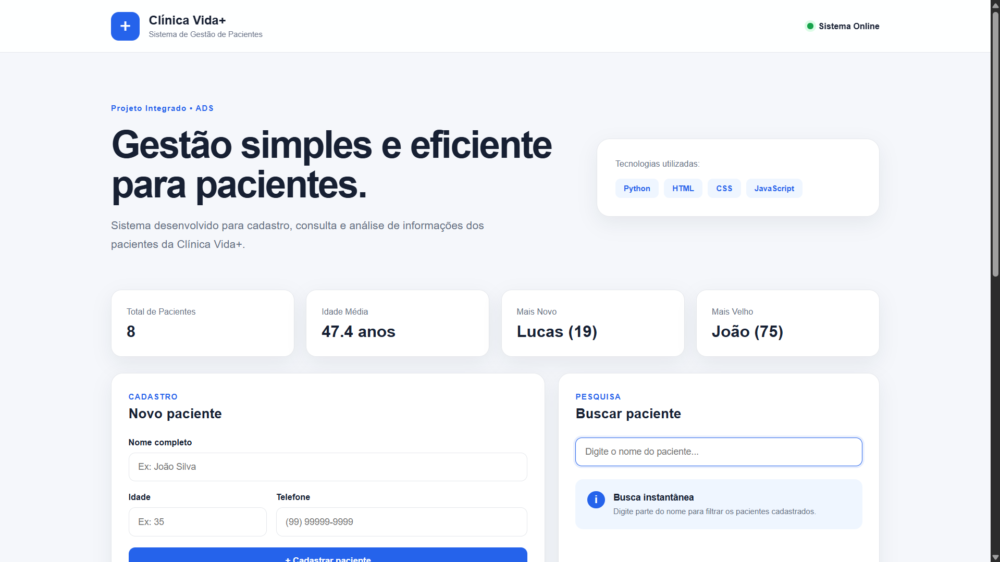
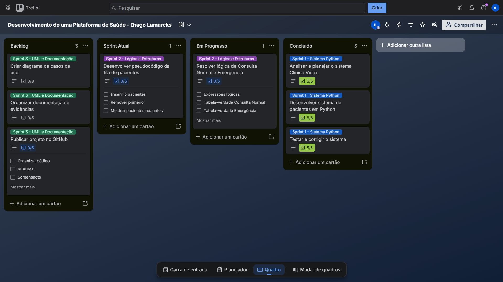
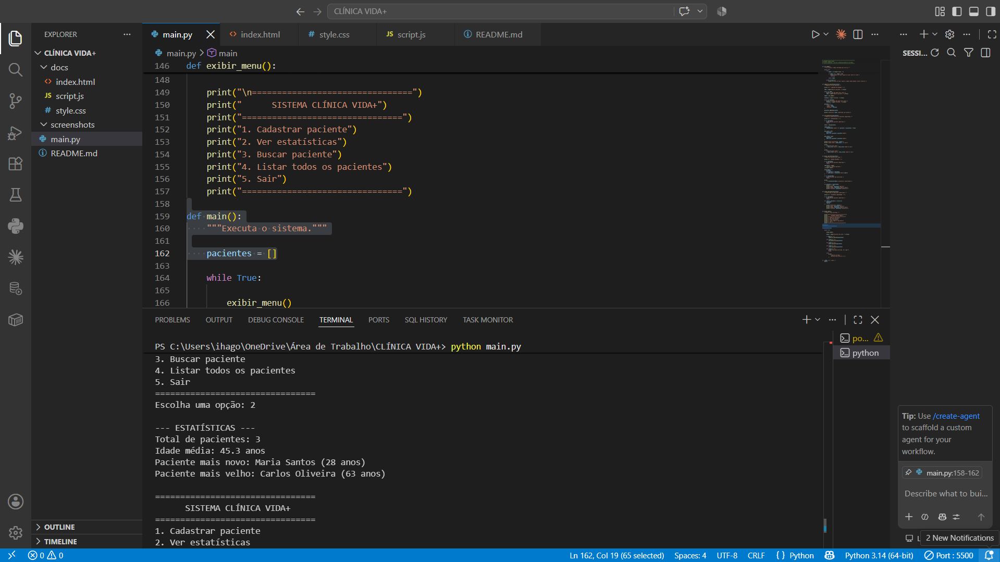
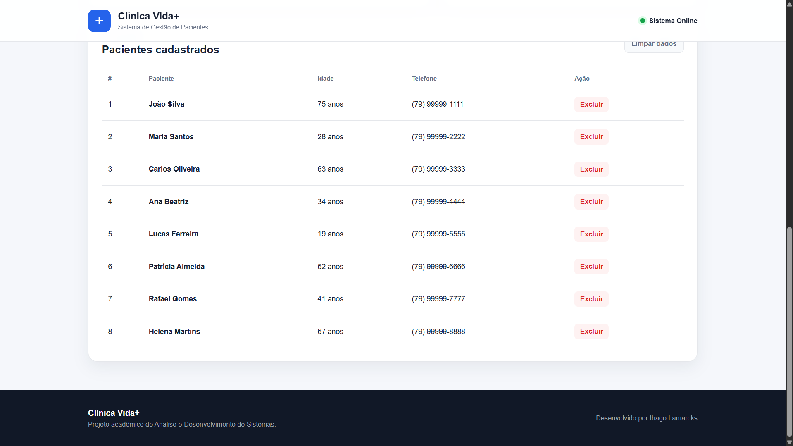

<div align="center">

# 🏥 CLÍNICA VIDA+

### Sistema de Gestão de Pacientes

Projeto desenvolvido em **Python** e posteriormente evoluído para uma interface web utilizando **HTML, CSS e JavaScript**.

<br>


---

## 🌐 Teste a Aplicação

### [🚀 ACESSAR CLÍNICA VIDA+](https://lamarcks.github.io/clinica-vida-plus/)

<br>

[](https://lamarcks.github.io/clinica-vida-plus/)

> 💡 Clique na imagem para acessar e testar a aplicação.

---

## 📌 Sobre o projeto

</div>

O **Clínica Vida+** surgiu a partir de um Projeto Integrado da graduação em **Análise e Desenvolvimento de Sistemas**.

A proposta inicial foi desenvolver uma solução para gerenciamento de informações de pacientes, permitindo aplicar na prática conceitos estudados durante o curso.

Após concluir a implementação acadêmica, decidi **evoluir o projeto por iniciativa própria**, criando uma versão web mais visual, responsiva e interativa utilizando HTML, CSS e JavaScript.

> Este repositório apresenta principalmente o processo de desenvolvimento, as tecnologias utilizadas e a evolução da solução, preservando o conteúdo completo da atividade acadêmica.

---

# 🎯 Objetivo

O objetivo do projeto foi desenvolver uma aplicação simples para gerenciamento de pacientes e utilizar o processo como oportunidade para praticar:

* 🐍 Python
* 🧠 Lógica de programação
* 📚 Estruturas de dados
* 🔄 Scrum
* 📋 Trello
* 🌐 HTML5
* 🎨 CSS3
* ⚡ JavaScript
* 💾 LocalStorage
* 🔧 Git
* 🐙 GitHub

---

# 🚀 Evolução do Projeto

O desenvolvimento aconteceu em diferentes etapas:

```text
Situação-problema
        ↓
Análise dos requisitos
        ↓
Planejamento no Trello
        ↓
Desenvolvimento em Python
        ↓
Testes e correções
        ↓
Aplicação de conceitos acadêmicos
        ↓
Evolução da experiência do usuário
        ↓
Interface Web
        ↓
Persistência com LocalStorage
        ↓
Responsividade
        ↓
Documentação
        ↓
GitHub
```

A ideia foi não apenas concluir a atividade proposta, mas utilizar o projeto como base para praticar novas tecnologias e melhorar a apresentação da solução.

---

# 🔄 Planejamento com Scrum e Trello

O projeto foi organizado utilizando conceitos da metodologia ágil **Scrum**.

O acompanhamento das atividades foi realizado através de um quadro no Trello com as etapas:

```text
Backlog
   ↓
Sprint Atual
   ↓
Em Progresso
   ↓
Concluído
```

## 🔵 Sprint 1 — Sistema Python

A primeira etapa concentrou o desenvolvimento da aplicação principal.

* Analisar e planejar o sistema Clínica Vida+
* Desenvolver sistema de pacientes em Python
* Testar e corrigir o sistema

Essas atividades passaram pelo fluxo de desenvolvimento até serem concluídas.

---

## 🟣 Sprint 2 — Lógica e Estruturas

A segunda etapa foi dedicada à aplicação de conceitos computacionais trabalhados durante a graduação.

* Resolver lógica de Consulta Normal e Emergência
* Desenvolver pseudocódigo da fila de pacientes

Os detalhes completos dessas atividades foram preservados na entrega acadêmica.

---

## 🟢 Sprint 3 — UML e Documentação

A etapa final foi utilizada para organização, modelagem e preparação da apresentação do projeto.

* Criar diagrama de casos de uso
* Organizar documentação e evidências
* Publicar projeto no GitHub

---

## 📸 Evolução no Trello

O quadro foi atualizado ao longo do desenvolvimento para registrar a evolução real das tarefas.



---

# 🐍 Primeira Versão — Python

A primeira implementação funcional do sistema foi desenvolvida em **Python**.

Ela funciona diretamente pelo terminal e trabalha os fundamentos da linguagem sem utilização de frameworks externos.

## Principais funcionalidades

* 👤 Cadastro de pacientes
* 🔎 Busca de pacientes
* 📋 Listagem dos registros
* 📊 Estatísticas dos pacientes
* 📈 Cálculo da idade média
* 🧒 Identificação do paciente mais novo
* 👴 Identificação do paciente mais velho
* ⚠️ Validação de entradas
* 🔄 Menu interativo

---

# 📚 Organização dos dados

Na versão Python, os pacientes são armazenados utilizando uma lista, enquanto cada paciente é representado por um dicionário.

Exemplo simplificado:

```python
paciente = {
    "nome": "Nome do paciente",
    "idade": 30,
    "telefone": "(00) 00000-0000"
}
```

Essa estrutura permitiu praticar conceitos fundamentais como:

```text
Listas
Dicionários
Funções
Condicionais
Laços de repetição
Tratamento de exceções
Manipulação de dados
```

---

# 📊 Testes da aplicação

Durante o desenvolvimento foram utilizados diferentes pacientes fictícios para verificar o comportamento das funcionalidades.

Entre os testes realizados:

* Cadastro de múltiplos pacientes
* Busca por nome
* Listagem dos registros
* Cálculo da idade média
* Identificação de diferentes faixas de idade
* Validação de informações
* Entradas incorretas
* Fluxo de encerramento do sistema

### Estatísticas



---

# 🌐 Evolução para Web

Após finalizar a versão em Python, decidi expandir o projeto.

Foi criada uma segunda experiência utilizando:

```text
HTML5
CSS3
JavaScript
LocalStorage
```

O objetivo foi transformar uma aplicação originalmente executada pelo terminal em uma interface visual mais agradável para utilização e apresentação.

> A versão web representa uma evolução adicional do projeto. A implementação em Python foi mantida como parte principal do desenvolvimento original.

---

# 👤 Gerenciamento de Pacientes

Os pacientes cadastrados são exibidos em uma tabela organizada.



É possível:

* cadastrar novos registros;
* visualizar pacientes;
* pesquisar pelo nome;
* excluir registros;
* acompanhar as estatísticas automaticamente.

---

# ⚡ JavaScript

O JavaScript é responsável pela lógica da versão web.

Entre suas responsabilidades estão:

```text
Cadastro de pacientes
        ↓
Validação dos dados
        ↓
Atualização da lista
        ↓
Cálculo das estatísticas
        ↓
Busca dinâmica
        ↓
Persistência dos registros
```

A interface é atualizada automaticamente conforme as operações são realizadas.

---

# 💾 LocalStorage

Para esta versão do projeto, foi utilizado o **LocalStorage** do navegador.

Isso permite armazenar os registros localmente sem necessidade de instalar ou configurar um banco de dados.

```text
Usuário cadastra paciente
          ↓
JavaScript processa
          ↓
LocalStorage salva
          ↓
Interface atualiza
          ↓
Dados permanecem no navegador
```

Essa solução foi escolhida por ser compatível com a proposta de uma demonstração front-end simples.

---

# 🔎 Busca Dinâmica

A versão web também permite pesquisar pacientes em tempo real.

Conforme o usuário digita parte do nome, o JavaScript filtra os registros exibidos na tabela.

Isso tornou a experiência mais prática do que a versão inicial executada pelo terminal.

---

# 📱 Responsividade

A interface também foi adaptada para diferentes tamanhos de tela.

O projeto pode ser visualizado em:

```text
💻 Desktop
💻 Notebook
📲 Tablet
📱 Smartphone
```

Foram utilizadas regras de responsividade no CSS para reorganizar os elementos conforme o tamanho da tela disponível.

---

# 🏗️ Arquitetura do Projeto

```text
                     CLÍNICA VIDA+
                           │
             ┌─────────────┴─────────────┐
             │                           │
             ▼                           ▼
         PYTHON CLI                 VERSÃO WEB
             │                           │
             ▼                           ▼
          Funções                       HTML
             │                           │
             ▼                           ▼
     Listas e Dicionários               CSS
             │                           │
             ▼                           ▼
         Estatísticas               JavaScript
                                         │
                                         ▼
                                   LocalStorage
```

---

# 🛠️ Tecnologias utilizadas

| Tecnologia       | Aplicação                                 |
| ---------------- | ----------------------------------------- |
| **Python**       | Desenvolvimento da primeira versão        |
| **HTML5**        | Estrutura da interface web                |
| **CSS3**         | Design e responsividade                   |
| **JavaScript**   | Interatividade e lógica da aplicação      |
| **LocalStorage** | Persistência dos registros no navegador   |
| **Trello**       | Organização e acompanhamento do projeto   |
| **Scrum**        | Organização das etapas de desenvolvimento |
| **Git**          | Controle de versão                        |
| **GitHub**       | Publicação e documentação                 |
| **VS Code**      | Ambiente de desenvolvimento               |

---

# 📂 Estrutura do Repositório

```text
CLÍNICA VIDA+/
│
├── docs/
│   ├── index.html
│   ├── script.js
│   └── style.css
│
├── screenshots/
│   ├── lista-pacientes.png
│   ├── tela-principal.png
│   ├── test-estatisticas.png
│   ├── trello.png
│   └── outros registros de testes
│
├── main.py
│
└── README.md
```

---

# ▶️ Como executar

## 🐍 Sistema Python

Clone o repositório:

```bash
git clone https://github.com/Lamarcks/clinica-vida-plus.git
```

Entre na pasta:

```bash
cd clinica-vida-plus
```

Execute:

```bash
python main.py
```

No Windows também é possível utilizar:

```bash
py main.py
```

---

## 🌐 Interface Web

A versão web está localizada na pasta:

```text
docs/
```

Para executar localmente, abra:

```text
docs/index.html
```

Também é possível utilizar a extensão **Live Server** no Visual Studio Code.

---

# 🧠 Principais desafios

Durante o projeto, alguns pontos exigiram maior atenção.

### 🐍 Estruturação da aplicação

Separar as responsabilidades em funções para manter o código Python mais organizado e fácil de compreender.

### 📚 Manipulação de dados

Utilizar listas e dicionários para armazenar e consultar as informações dos pacientes.

### ⚠️ Validação

Garantir que entradas incorretas não encerrassem inesperadamente a aplicação.

### 🌐 Evolução para interface web

Transformar a lógica de uma aplicação executada no terminal em uma experiência visual utilizando tecnologias front-end.

### ⚡ Atualização dinâmica

Manter cadastro, busca, exclusão, listagem e estatísticas sincronizados na interface.

### 💾 Persistência

Encontrar uma solução simples para manter os dados disponíveis após a atualização da página.

### 📱 Responsividade

Adaptar os componentes para que a aplicação continuasse utilizável em diferentes dispositivos.

---

# 📈 Aprendizados

O Clínica Vida+ permitiu colocar em prática diferentes conhecimentos dentro de um único projeto:

```text
Python
├── Funções
├── Listas
├── Dicionários
├── Condicionais
├── Loops
└── Tratamento de erros

Front-end
├── HTML
├── CSS
├── JavaScript
├── DOM
├── Eventos
├── Arrays e Objetos
├── LocalStorage
└── Responsividade

Projeto
├── Scrum
├── Trello
├── Organização de tarefas
├── Testes
├── Git
└── GitHub
```

Mais do que finalizar os requisitos iniciais, o projeto serviu como oportunidade para praticar a **evolução de uma solução existente**.

---

# 💡 Próximas Evoluções

A aplicação foi mantida propositalmente simples nesta versão, mas pode futuramente receber novas funcionalidades.

Algumas possibilidades:

* 🗄️ Banco de dados
* 🔐 Autenticação
* 👨‍⚕️ Gerenciamento de médicos
* 📅 Agendamentos
* 🧪 Gerenciamento de exames
* 📝 Histórico de atendimentos
* 📊 Dashboard administrativo
* 🔌 API REST
* 🐍 Back-end web em Python
* ☁️ Deploy em Cloud

> Essas funcionalidades são possibilidades futuras e não fazem parte da versão atual do projeto.

---

# 🎓 Contexto Acadêmico

O Clínica Vida+ teve origem em um **Projeto Integrado** realizado durante a graduação em **Análise e Desenvolvimento de Sistemas**.

A atividade permitiu trabalhar diferentes conhecimentos acadêmicos dentro de um mesmo cenário.

Neste repositório, optei por apresentar o **processo, o desenvolvimento e a evolução técnica da aplicação**, sem disponibilizar integralmente as soluções e respostas da atividade acadêmica.

---

# 👨‍💻 Autor

## Ihago Lamarcks

Estudante de **Análise e Desenvolvimento de Sistemas**, desenvolvendo conhecimentos em software, Inteligência Artificial, Cloud e outras soluções tecnológicas.

[](https://www.linkedin.com/in/ihago-lamarcks1/)

---

<div align="center">

### ⭐ Projeto desenvolvido como parte da minha evolução em Análise e Desenvolvimento de Sistemas.

**Python • JavaScript • HTML • CSS • Git • GitHub**

</div>
