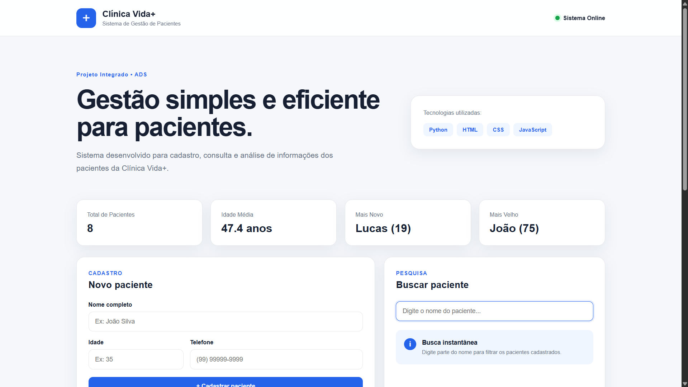
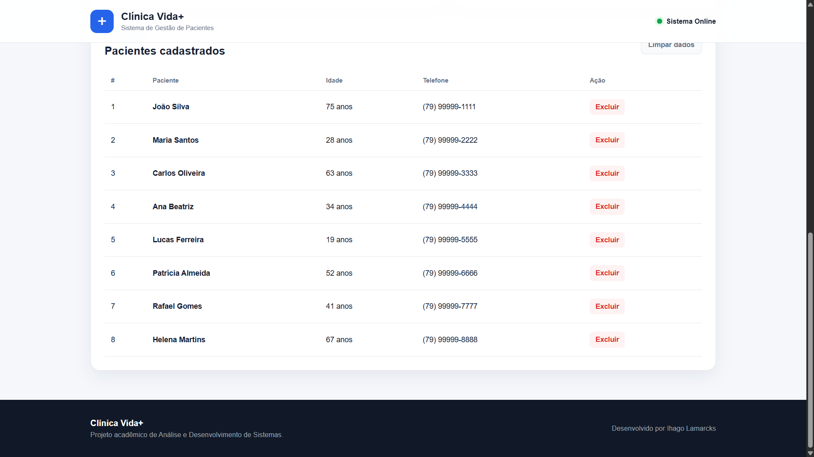
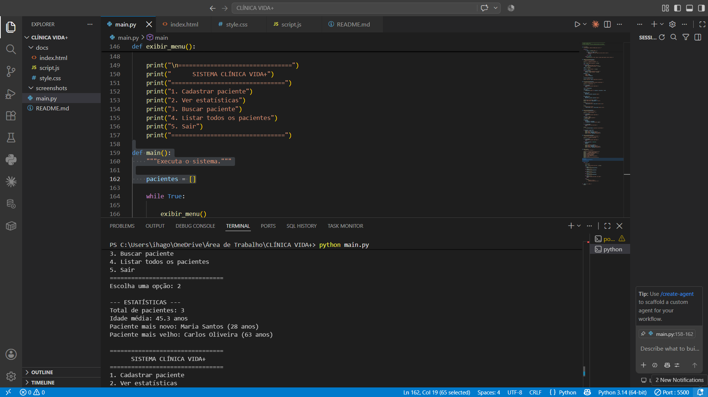
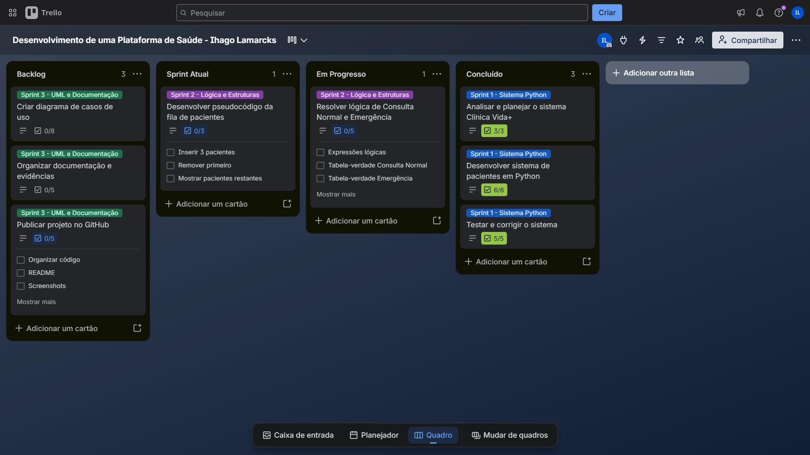

<div align="center">

# Clínica Vida+

### Sistema de Gestão de Pacientes

Aplicação desenvolvida originalmente em Python e posteriormente evoluída para uma interface web utilizando HTML, CSS e JavaScript.

<br>


<br>

### Acessar a aplicação

**[Abrir Clínica Vida+](https://lamarcks.github.io/clinica-vida-plus/)**

[](https://lamarcks.github.io/clinica-vida-plus/)

> Clique na imagem acima para acessar e testar a aplicação.

</div>

---

## Sobre o projeto

O **Clínica Vida+** surgiu como um projeto integrado da graduação em **Análise e Desenvolvimento de Sistemas**, inicialmente desenvolvido em Python para praticar lógica de programação, estruturas de dados e manipulação de informações.

Após concluir a implementação inicial, o projeto foi evoluído por iniciativa própria para uma aplicação web.

A nova versão utiliza **HTML, CSS e JavaScript**, adicionando uma interface gráfica, persistência de dados no navegador, busca dinâmica, estatísticas e adaptação para diferentes tamanhos de tela.

O projeto representa, portanto, duas etapas de desenvolvimento:

```text
Versão inicial
Python + terminal
       │
       ▼
Evolução
HTML + CSS + JavaScript
       │
       ▼
Aplicação Web
LocalStorage + interface responsiva
```

---

## Objetivo

O objetivo principal é desenvolver uma aplicação simples para gerenciamento de pacientes e, ao mesmo tempo, utilizar o projeto para praticar diferentes conceitos de desenvolvimento de software.

Entre os conhecimentos aplicados estão:

* Python;
* lógica de programação;
* funções;
* listas e dicionários;
* HTML;
* CSS;
* JavaScript;
* manipulação do DOM;
* eventos;
* LocalStorage;
* validação de dados;
* busca e filtragem;
* responsividade;
* Git e GitHub.

---

## Funcionalidades

### Cadastro de pacientes

A aplicação permite cadastrar pacientes informando:

* nome;
* idade;
* telefone.

Os dados passam por validações antes de serem adicionados.

### Busca de pacientes

A busca é realizada dinamicamente conforme o usuário digita.

```text
Digite um nome
      ↓
JavaScript filtra os registros
      ↓
Tabela atualizada
```

A pesquisa não precisa de uma nova página ou recarregamento.

### Listagem

Os pacientes cadastrados são apresentados em uma tabela contendo:

* número do registro;
* nome;
* idade;
* telefone;
* opção de exclusão.

### Exclusão

É possível remover pacientes individualmente.

Antes da exclusão, a aplicação solicita confirmação ao usuário.

### Limpeza dos dados

Também existe uma opção para remover todos os pacientes cadastrados.

A operação exige confirmação antes de ser executada.

### Estatísticas

A aplicação calcula automaticamente:

* total de pacientes;
* idade média;
* paciente mais novo;
* paciente mais velho.

As estatísticas são atualizadas sempre que os dados são modificados.

---

## Persistência com LocalStorage

A versão web utiliza o **LocalStorage** do navegador para armazenar os pacientes.

Isso permite que os registros permaneçam disponíveis mesmo após atualizar a página.

O fluxo é:

```text
Cadastro
   ↓
Objeto JavaScript
   ↓
Array de pacientes
   ↓
JSON.stringify()
   ↓
LocalStorage
```

Na inicialização da aplicação, os dados são recuperados novamente:

```text
LocalStorage
     ↓
JSON.parse()
     ↓
Array de pacientes
     ↓
Interface
```

Essa solução foi utilizada por ser adequada ao objetivo da versão front-end, sem exigir um servidor ou banco de dados externo.

---

## Validação dos dados

A aplicação possui validações tanto na versão Python quanto na versão web.

### Python

A idade deve estar entre:

```text
0 e 130 anos
```

Nome e telefone também não podem ficar vazios.

Entradas inválidas são tratadas sem encerrar o programa.

### JavaScript

A versão web realiza verificações semelhantes antes de cadastrar um paciente:

* nome obrigatório;
* telefone obrigatório;
* idade numérica;
* idade entre 0 e 130 anos.

---

## Tratamento de conteúdo inserido pelo usuário

Na versão web existe uma função específica para escapar conteúdo antes de inseri-lo na tabela:

```javascript
function escaparHTML(texto) {
    const elemento = document.createElement("div");
    elemento.textContent = texto;
    return elemento.innerHTML;
}
```

Essa abordagem evita interpretar diretamente determinados conteúdos fornecidos pelo usuário como HTML.

É um exemplo de preocupação com segurança mesmo em uma aplicação front-end simples.

---

## Arquitetura da versão web

A aplicação é dividida em três arquivos principais:

```text
docs/
│
├── index.html
├── style.css
└── script.js
```

### `index.html`

Responsável pela estrutura da interface:

* cabeçalho;
* formulário;
* estatísticas;
* busca;
* tabela de pacientes;
* mensagens;
* rodapé.

### `style.css`

Responsável pela apresentação visual:

* layout;
* cores;
* tipografia;
* cartões;
* tabela;
* botões;
* estados visuais;
* responsividade.

### `script.js`

Responsável pela lógica da aplicação:

* cadastro;
* validação;
* exclusão;
* busca;
* estatísticas;
* LocalStorage;
* atualização da interface;
* mensagens de feedback.

---

## Fluxo da aplicação

```text
                    Usuário
                       │
                       ▼
                Formulário Web
                       │
                       ▼
                Validação dos dados
                       │
                       ▼
               Array de pacientes
                  /          \
                 /            \
                ▼              ▼
         LocalStorage       Interface
                │              │
                │              ▼
                │        Tabela / Busca
                │              │
                └──────► Estatísticas
```

---

## Interface

A interface foi construída com foco em simplicidade e organização.

A página apresenta:

* identificação do sistema;
* indicador de status;
* apresentação do projeto;
* cards de estatísticas;
* formulário de cadastro;
* campo de pesquisa;
* tabela de pacientes;
* mensagens de feedback;
* layout adaptável.

### Tela principal


### Lista de pacientes



### Teste das estatísticas



---

## Responsividade

O CSS possui breakpoints para adaptar a interface a diferentes larguras de tela.

O layout é reorganizado principalmente em:

```text
Desktop
   ↓
Tablet
   ↓
Smartphone
```

Alguns componentes passam de estruturas em múltiplas colunas para uma única coluna em telas menores.

A tabela também utiliza rolagem horizontal quando necessário.

---

## Versão inicial em Python

Antes da versão web, o projeto funcionava através do terminal.

O arquivo:

```text
main.py
```

contém a implementação inicial.

### Funcionalidades

* cadastro de pacientes;
* busca por nome;
* listagem de pacientes;
* estatísticas;
* cálculo da idade média;
* identificação do mais novo;
* identificação do mais velho;
* validação de entradas;
* menu interativo.

### Estrutura dos dados

Cada paciente é representado por um dicionário:

```python
paciente = {
    "nome": "Nome do paciente",
    "idade": 30,
    "telefone": "(00) 00000-0000"
}
```

Os pacientes são armazenados em uma lista.

Isso permitiu praticar estruturas fundamentais da linguagem antes da evolução para a aplicação web.

---

## Organização do desenvolvimento

O projeto também foi utilizado para praticar conceitos de organização de projetos utilizando **Scrum** e **Trello**.

O planejamento foi dividido em etapas envolvendo:

```text
Análise
   ↓
Planejamento
   ↓
Desenvolvimento
   ↓
Testes
   ↓
Documentação
   ↓
Evolução
```

### Registro do planejamento



A utilização do Trello ajudou a acompanhar as tarefas e visualizar a evolução do projeto.

---

## Tecnologias utilizadas

| Tecnologia       | Utilização                          |
| ---------------- | ----------------------------------- |
| **Python**       | Versão inicial do sistema           |
| **HTML5**        | Estrutura da aplicação web          |
| **CSS3**         | Interface e responsividade          |
| **JavaScript**   | Lógica e interatividade             |
| **LocalStorage** | Persistência dos dados              |
| **Git**          | Controle de versão                  |
| **GitHub**       | Hospedagem do código e documentação |
| **GitHub Pages** | Publicação da versão web            |
| **Trello**       | Organização das tarefas             |
| **Scrum**        | Organização do desenvolvimento      |

---

## Estrutura do repositório

```text
clinica-vida-plus/
│
├── docs/
│   ├── index.html
│   ├── script.js
│   └── style.css
│
├── screenshots/
│   ├── lista-pacientes.png
│   ├── tela-principal.png
│   ├── test-estatisticas.png
│   ├── trello.png
│   └── validando-pacientes.png
│
├── main.py
├── .gitattributes
└── README.md
```

---

## Como executar

### Versão Python

Clone o repositório:

```bash
git clone https://github.com/Lamarcks/clinica-vida-plus.git
```

Entre na pasta:

```bash
cd clinica-vida-plus
```

Execute:

```bash
python main.py
```

No Windows, também pode ser utilizado:

```bash
py main.py
```

---

### Versão Web

A aplicação web está dentro da pasta:

```text
docs/
```

Para executar localmente, basta abrir:

```text
docs/index.html
```

Também é possível utilizar uma extensão como **Live Server** no VS Code.

### Versão publicada

A versão web está disponível através do GitHub Pages:

**https://lamarcks.github.io/clinica-vida-plus/**

---

## O que aprendi com o projeto

O Clínica Vida+ foi importante principalmente por permitir observar a evolução de uma mesma solução através de diferentes tecnologias.

A primeira versão ajudou a praticar fundamentos de programação:

```text
Python
├── Funções
├── Listas
├── Dicionários
├── Condicionais
├── Loops
└── Tratamento de erros
```

A evolução para web acrescentou:

```text
Front-end
├── HTML
├── CSS
├── JavaScript
├── DOM
├── Eventos
├── Arrays
├── Objetos
├── LocalStorage
└── Responsividade
```

Além disso, o projeto trouxe experiência com:

```text
Scrum
Trello
Git
GitHub
GitHub Pages
Documentação
Testes
```

---

## Próximas possibilidades

A versão atual utiliza LocalStorage e foi desenvolvida como uma aplicação front-end.

Uma possível evolução seria transformar o projeto em uma aplicação com arquitetura completa:

```text
Frontend
    │
    ▼
API
    │
    ▼
Backend
    │
    ▼
Banco de dados
```

Entre as possibilidades futuras estão:

* autenticação de usuários;
* diferentes níveis de acesso;
* banco de dados;
* API REST;
* cadastro de profissionais;
* agendamento de consultas;
* histórico de atendimentos;
* dashboard administrativo;
* validações mais completas;
* deploy de uma arquitetura full-stack.

Essas funcionalidades **não fazem parte da versão atual**.

---

## Autor

**Ihago Lamarcks**

[](https://www.linkedin.com/in/ihago-lamarcks1/)

---

<div align="center">

**Clínica Vida+**

Projeto desenvolvido como parte da evolução acadêmica e prática em desenvolvimento de software.

</div>
